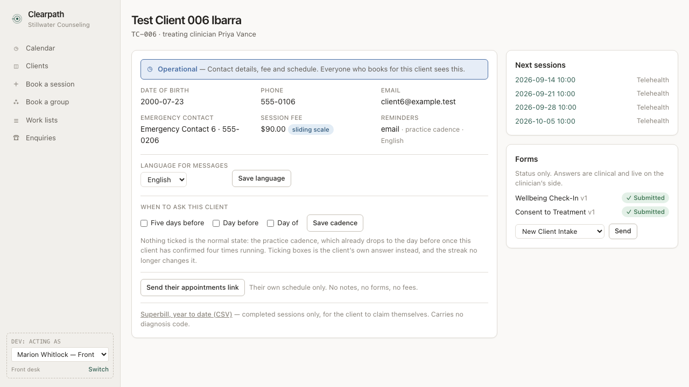
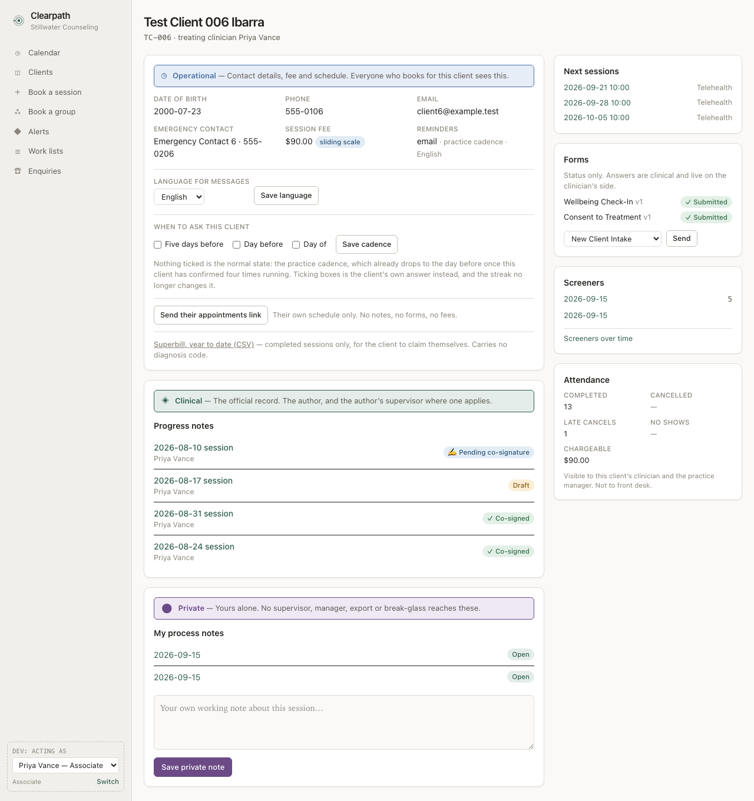
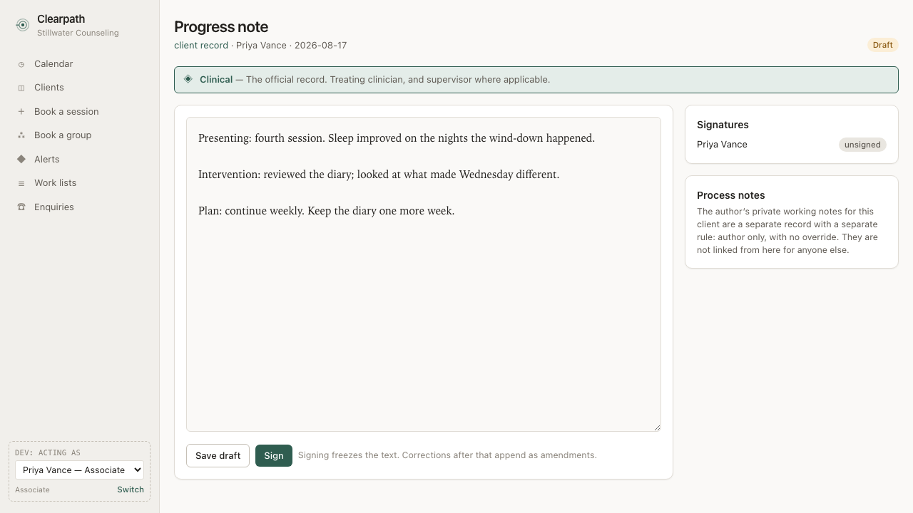
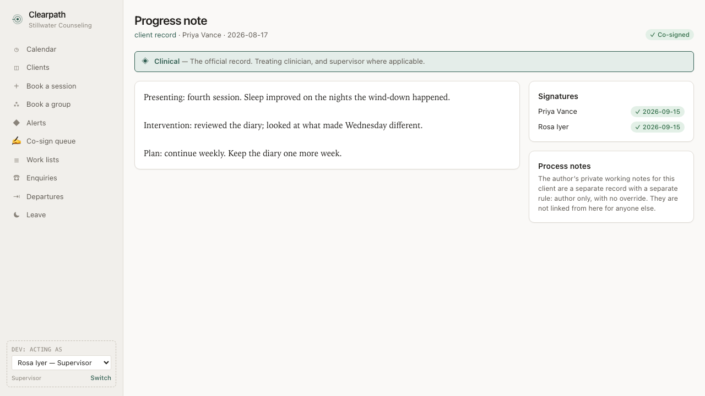
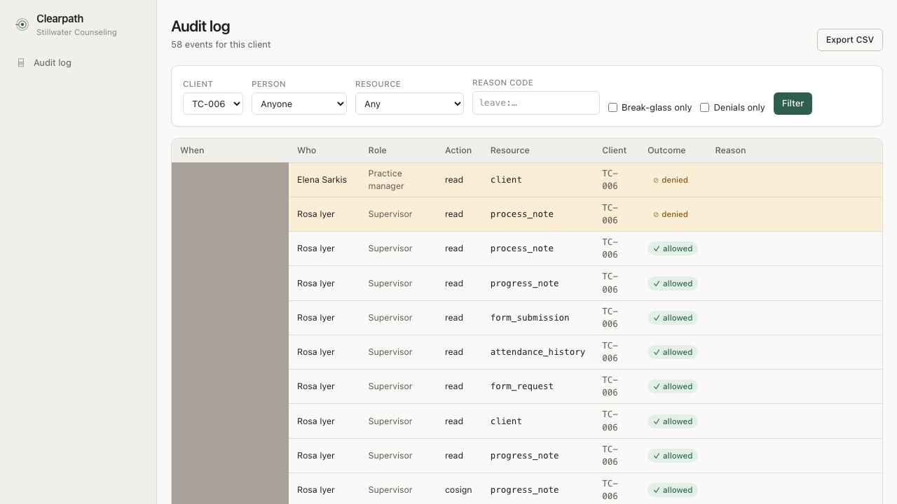

# Clearpath — Clinic Operations for a Counseling Practice

Operations software for a small group counseling practice: recurring sessions
across shared therapy rooms, layered confidentiality, supervision workflows,
scored intake screeners, and a tamper-evident audit trail.

Sample practice: **Stillwater Counseling** — 6 clinicians (2 licensed
supervisors, 3 licensed therapists, 1 pre-licensed associate), 4 therapy rooms.

---

## ⚠️ Scope Honesty (read first)

This is a **learning project with synthetic data only**. It applies HIPAA-*inspired*
design principles — least-privilege access, audit trails, no PHI in logs/URLs, and
the psychotherapy-notes distinction — because they're excellent engineering
discipline. It is **not** HIPAA-compliant software and must never hold real client
data. Mental-health data is among the most sensitive that exists; modeling the
protections is the lesson, claiming them would be the credibility-killer.

**Nothing sends, nothing is received, and nothing charges.** `OutboxMessage` rows
are the stub for every reminder — there is no carrier integration, and the
delivery receipts the fee depends on come from `npm run delivery:run` answering
on a carrier's behalf — and an inbound reply arrives through
`npm run inbound:simulate` rather than a webhook,
deliberately: an unauthenticated endpoint that writes to a client's record needs
a provider signature to verify, and a signature nobody issues is a security
control that only looks like one. `chargeFeeCents` is a chargeable
*flag* in integer cents with no payment processing anywhere behind it. The
automatic no-show fee for a client who never answers is a **modeled mechanism,
not clinical or legal advice**: a real practice cannot switch that policy on
without a review of its client agreement, and the settings page says so where the
switch is.

---


---

## The access rule that shapes everything

Two classes of clinical note, with different rules:

| | `progress_note` (the official record) | `process_note` (private working notes) |
|---|---|---|
| Author | read / write / sign | read / write |
| Supervisor of author | read + **co-sign** | **403, always** |
| Treating clinician (not author) | no | no |
| Practice manager (admin) | read via logged **break-glass** | **403, always — break-glass does not reach it** |
| Front desk | no | no |
| Auditor | no (sees the access event, not the content) | no |


A refusal is a sentence, not a 403: what the reader gets is the rule and where
the official record is instead.

The same client record, at the same URL, through two pairs of eyes. The front
desk gets the operational tier — who, when, which room, whether consent is
signed, whether forms came back:



The treating clinician gets the same page with the clinical tier on it — progress
notes, screener results, attendance — plus their own process notes, which the
picture above has no version of at any permission level:



Cover is the same rule with an end date. While a clinician is away, somebody
else can open their clients' records and is sent their alerts; the day after,
they cannot. What the returning clinician gets is a summary of those days —
built out of the cells they already hold as the treating clinician, plus one
more for a supervisor, because the countersignatures given to their supervisees
are not about their caseload and ride the door supervision already reads notes
through:


The coverer's own process notes are not in it, and there is no version of this
screen in which they would be — the same rule as the table above, applied to a
permission that was temporary.

Every one of those cells is asserted in [`src/auth/permissions.test.ts`](src/auth/permissions.test.ts).
Authorization happens in exactly one place — [`src/auth/permissions.ts`](src/auth/permissions.ts) —
and a test greps the rest of `src/` to prove no endpoint re-implements a role check.

## Known limitations (deliberate)

- **No real auth.** A dev-mode user switcher stands in for login. Two-factor and
  session management are their own project. The *policy* — which roles would sit
  behind a second factor — is written and tested in `permissions.ts`, and the
  person picker marks those roles, so the seam is visible rather than implied.
  Nothing enforces it, because a check that always passes reads as a control.
- **No insurance billing.** The superbill exports completed sessions with their
  CPT codes and the fee recorded at the time of service, which is what a client
  needs to claim reimbursement themselves. It carries no diagnosis code —
  Clearpath does not model diagnoses — and says so on the export.
- **No telehealth video.** An appointment carries a modality flag and a join-link
  field; the *scheduling* consequences of modality are the lesson.
- **One treating clinician per client.** Group sessions exist (one hour, one
  clinician, N attendees, each with their own note and fee), but couples work
  with two clinicians on one record does not.
- **Clients never log in.** Forms, confirmations and their own schedule arrive by
  tokenized link. The portal shows appointment times and nothing clinical, and a
  reschedule request is a reason code rather than a message — there is no
  free-text channel from a client to the front desk. A client who texts back in
  words anyway is understood rather than ignored: the message is classified as
  `confirm`, `decline` or `unparsed` and the words are then dropped, with no
  column anywhere to hold them. An `unparsed` reply reaches the treating
  clinician as a reason code and reaches front desk as "call them".
- **All outbound messages are outbox stubs.** Nothing is actually sent. They do
  carry a delivery lifecycle — `queued → sent → delivered | failed` — and the
  no-show fee requires a `delivered` receipt rather than a queued row, so the
  practice cannot charge a client for its own failed send. The receipts come
  from `npm run delivery:run`, a simulated carrier; attaching a real one
  replaces that script and nothing else.

## Stack

Next.js (App Router) · Prisma · PostgreSQL · Vitest · Playwright · TypeScript

## Running it

```bash
createdb clearpath_dev clearpath_test clearpath_e2e clearpath_shadow
npm install
npm run db:setup     # migrate all three, generate the client, seed dev + e2e
npm run dev          # http://localhost:3700
npm test             # 1,552 unit + integration tests
npm run test:e2e     # 24 Playwright tests against a production build
```

The confirmation loop runs as commands, because the due times derive from
`startAt` and an injected clock — so the schedule is an implementation detail of
whatever calls them. On the deployment, Vercel Cron calls `reminders:run` hourly
and `purge:run` daily through `/api/cron/*`, behind `CRON_SECRET`. The rest are
invoked by hand:

```bash
npm run reminders:run      # queue every reminder stage that has come due, then move leave alerts
npm run purge:run          # every retention window: enquiries, departed process notes
npm run delivery:run       # the carrier stub: hand over, then hear back
npm run nonresponse:run    # the half with money attached, stoppable on its own
npm run inbound:simulate -- 555-0101 "can we talk first"   # a client writes back
```

Local Postgres only, three databases and each for one job:

| Database | Used by | Contents |
|---|---|---|
| `clearpath_dev` | `npm run dev` | a seeded practice quarter |
| `clearpath_test` | `npm test` | truncated between every test |
| `clearpath_e2e` | `npm run test:e2e` | re-seeded at the start of each sweep |

`clearpath_test` and `clearpath_e2e` are separate on purpose. The unit suite
truncates every table between tests and the e2e sweep needs a seeded practice;
sharing one database means whichever suite ran last decides what the other sees.

There is no login. The dev switcher in the sidebar runs the app as any seeded
person — see **Known limitations**. Authorization is real either way.

### The 60-second demo

One note, followed from the hand that writes it to the log that records who
read it. The seed leaves client `TC-006` a draft note by Priya Vance so the
first step is a real signature rather than a pose.

1. Act as **Priya Vance** (pre-licensed associate) → open her draft progress
   note on that client → **Sign**. Signing freezes the text; from here
   corrections are amendments, appended under a frozen original.

   

2. Because Priya is pre-licensed, that signature is not the end of it. Act as
   **Rosa Iyer** (supervisor) → **Co-sign queue**: the note is already there.
   Nobody routed it — the supervision map did.

   

3. Co-sign it. It leaves the queue, and the note itself now reads as
   countersigned.

   

4. Still as Rosa, open that client's record. Everything clinical is there —
   attendance, screeners, the note she just countersigned — and where Priya's
   process notes would be there is a locked panel stating the rule. She
   supervises the author and still does not get in.

   Act as **Elena Sarkis** (practice manager) → open the same client → break
   glass with a reason → the record opens, flagged. The process notes stay shut.

   

5. Act as **Owen Delacroix** (auditor) → **Audit log**, filtered to this client
   → both events are in the one table: the co-signature that was allowed and
   the process-note read that was refused. Ids only — no names, no note
   content, no answers.

   

   One row in that picture is worth reading twice: `Rosa Iyer · read ·
   process_note · allowed`. It is not the supervisor reading her supervisee's
   private notes — [`listProcessNotes`](src/notes/service.ts) filters
   `authorId = actor.id` in SQL and selects no `content` column at all, so what
   she read was her *own* process notes for this client, of which she has none.
   The log records the request and the outcome, never the rows returned; that is
   the same rule as everywhere else — ids only, and no PHI in the audit trail.
   An `allowed` here means "allowed to read her own", and the highlighted
   refusal directly above it is what happened when she asked for one of
   Priya's.

   Filtered to denials of process notes alone, the same log answers the
   narrower question — who has been turned away, and from what:

   

[`e2e/confidentiality.spec.ts`](e2e/confidentiality.spec.ts) is that walkthrough
as a test, and [`e2e/screenshots.spec.ts`](e2e/screenshots.spec.ts) is the same
walk again with a camera — every picture on this page is captured from the
seeded practice the suite runs against, by `npm run shots`, so none of them can
drift from the product without a rebuild.

The seed creates obviously-fake clients (`Test Client 001` …) across a scripted
practice quarter: 70 clients on standing weekly or biweekly slots, a clinician's
week of annual leave with the standing sessions it displaces, ~86 form
submissions including flagged screeners, three break-glass events and a logged
process-note refusal. Three of its people exist to carry one state each: a
planned departure, a leave that is on while the suite runs, and a leave that
ended yesterday — dated from the real clock rather than the seed's, because
those three are only themselves relative to the day you look.

## Design

`DESIGN-BRIEF.md` is the brief the interface was built from — personas, the
confidentiality constraints that drive the visual language, the screen
inventory, and the tokens. `app/theme.css` holds every colour, type and spacing
value in the product under semantic names; swapping in a different design system
means replacing that file's values and nothing else.

[`/design`](app/design/page.tsx) is the brief's component inventory, rendered
from the components the app itself imports and the tokens the app itself reads —
a style guide that redraws its specimens by hand starts lying the first week, so
this one is wrong only when the product is wrong. A unit test compares the
components exported from `src/ui/primitives.tsx` against the specimens on the
page, because break-glass and the list-level denial both shipped without one.


## Where the interesting parts live

| | |
|---|---|
| The permission matrix | [`src/auth/permissions.ts`](src/auth/permissions.ts) |
| The single guarded door, and the audit write | [`src/auth/guard.ts`](src/auth/guard.ts) |
| Constraints the ORM cannot express | [`prisma/migrations/*_init/migration.sql`](prisma/migrations) |
| Recurrence, and the occurrence-key fix | [`src/scheduling/recurrence.ts`](src/scheduling/recurrence.ts) |
| Scoring, thresholds and critical items | [`src/forms/scoring.ts`](src/forms/scoring.ts) |
| Two-tier notes and co-signature | [`src/notes/service.ts`](src/notes/service.ts) |
| The discretion deny-list, one per language | [`src/messaging/outbox.ts`](src/messaging/outbox.ts) |
| Delivery receipts, and the fee that waits for one | [`src/messaging/delivery.ts`](src/messaging/delivery.ts) |
| Why any of it is shaped this way | [`WRITEUP.md`](WRITEUP.md) |
