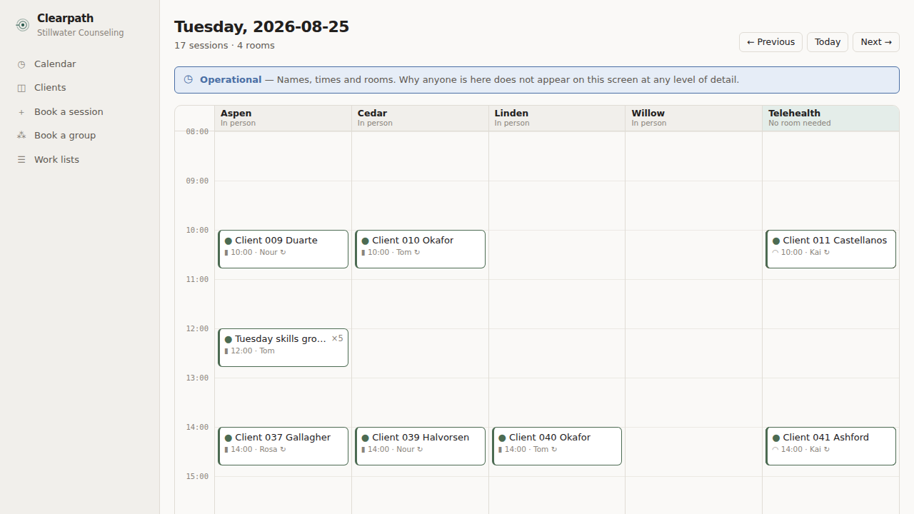
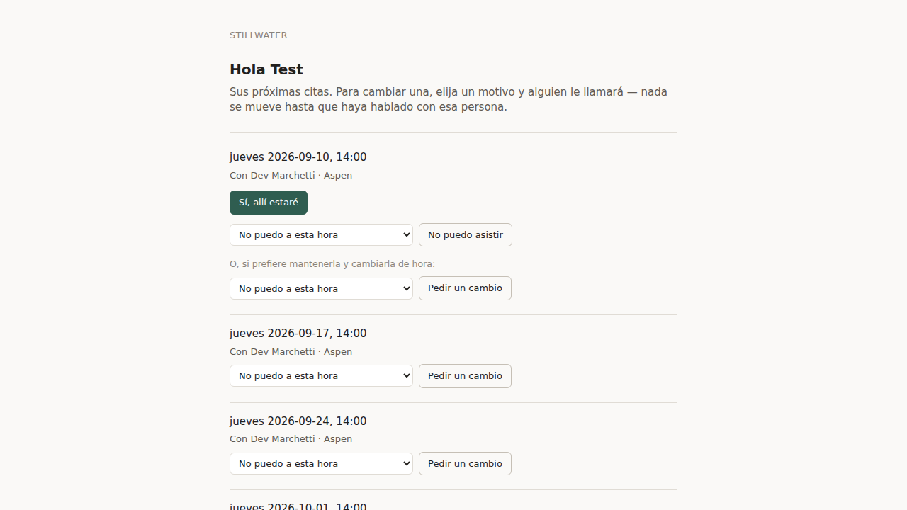
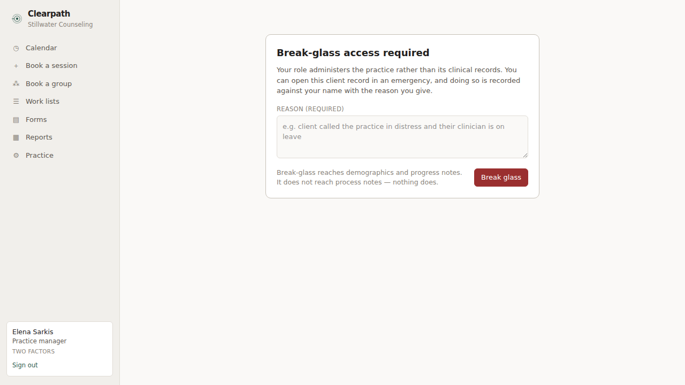

# Clearpath — Clinic Operations for a Counseling Practice

Operations software for a small group counseling practice: recurring sessions
across shared therapy rooms, layered confidentiality, supervision workflows,
scored intake screeners, and a tamper-evident audit trail.

Sample practice: **Stillwater Counseling** — 6 clinicians (2 licensed
supervisors, 3 licensed therapists, 1 pre-licensed associate), 4 therapy rooms.

---

## ⚠️ Scope Honesty (read first)

This is a **learning project with synthetic data only**. It applies HIPAA-*inspired*
design principles — least-privilege access, audit trails, no PHI in logs/URLs, and
the psychotherapy-notes distinction — because they're excellent engineering
discipline. It is **not** HIPAA-compliant software and must never hold real client
data. Mental-health data is among the most sensitive that exists; modeling the
protections is the lesson, claiming them would be the credibility-killer.

**Nothing sends and nothing charges.** Every message is a row in an outbox table
handed to a *simulated* carrier, and every fee is a flag on an appointment that
no payment processor sees. The carrier is a real seam — a `Carrier` interface,
delivery receipts, retries and failure codes — with the only shipped driver
being an offline stub, because a real credential here would mean real messages
to real handsets from a project whose first promise is that it holds nothing
real. The automatic no-show fee — a client who never answers three
reminders is marked absent and billed — is a *modeled mechanism*, built to show
what such a rule costs and what it has to refuse. It is not clinical advice, not
legal advice, and not a policy recommendation: the write-up argues at length
that a practice should ship the loop, watch a quarter of data, and only then
decide whether to turn the money on.

---



---

## Signing in

Staff sign in with an email and a password (scrypt, salted, with its cost
parameters written into every row). The three clinical roles and the practice
manager are then asked for a **second factor** — real TOTP, RFC 6238, verified
against the [published test vectors](src/auth/totp.test.ts) so an ordinary
authenticator app agrees with it.


The property worth stating is not that the second screen appears. It is that
the session has **no authority while it is showing**: `resolveSession` attaches
an actor only to a session that has satisfied its second factor, so a
half-finished sign-in is representable but cannot produce one. There is no
branch for anybody to forget.

Three more decisions behind it:

- **Enrolment is mandatory, not offered.** A role that requires a second factor
  and has not set one up lands on the enrolment screen and can reach nothing
  else. "Not set up yet" must not be the way past the check.
- **A code is spent once.** The accepted step is recorded on the *account*, so a
  code read over a shoulder cannot be used in a session the attacker opened
  themselves — the window it would otherwise stay valid for is the whole point
  of stealing it.
- **The lockout expires on its own.** Failed attempts escalate to a fifteen
  minute cap and never to a permanent lock. A lock an administrator must clear
  is a denial-of-service anybody holding a staff email can fire, and the target
  is a clinician who needs a progress note before a session.

The session itself is a random token whose SHA-256 is what the database stores,
with an idle timeout and an absolute ceiling. Signing out, deactivating a user
and changing a password all end live sessions immediately rather than at the
next timeout.

## The access rule that shapes everything

Two classes of clinical note, with different rules:

| | `progress_note` (the official record) | `process_note` (private working notes) |
|---|---|---|
| Author | read / write / sign | read / write |
| Supervisor of author | read + **co-sign** | **403, always** |
| Treating clinician (not author) | no | no |
| Practice manager (admin) | read via logged **break-glass** | **403, always — break-glass does not reach it** |
| Front desk | no | no |
| Auditor | no (sees the access event, not the content) | no |


A refusal is a sentence, not a 403: what the reader gets is the rule and where
the official record is instead.

Every one of those cells is asserted in [`src/auth/permissions.test.ts`](src/auth/permissions.test.ts).
Authorization happens in exactly one place — [`src/auth/permissions.ts`](src/auth/permissions.ts) —
and a test greps the rest of `src/` to prove no endpoint re-implements a role check.

## Known limitations (deliberate)

- **No password recovery, and no account administration.** Authentication itself
  is built — see below — but a clinician who loses their phone has no way back
  in, and there is no screen for setting somebody's first password. Both are
  real gaps rather than modelled ones. Recovery is the harder half of any
  authentication system and the half that most often becomes the way in, so it
  is unbuilt rather than half-built.
- **Demo accounts are listed on the sign-in screen.** With one published
  password, because a public demo over invented data has to be openable. It is
  account enumeration served up voluntarily and a real practice must never do
  it; the screen says so where it does it.
- **No insurance billing.** The superbill exports completed sessions with their
  CPT codes and the fee recorded at the time of service, which is what a client
  needs to claim reimbursement themselves. It carries no diagnosis code —
  Clearpath does not model diagnoses — and says so on the export.
- **No telehealth video.** An appointment carries a modality flag and a join-link
  field; the *scheduling* consequences of modality are the lesson.
- **One treating clinician per client.** Group sessions exist (one hour, one
  clinician, N attendees, each with their own note and fee), but couples work
  with two clinicians on one record does not.
- **Clients never log in.** Forms, confirmations and their own schedule arrive by
  tokenized link. The portal shows appointment times and nothing clinical, and a
  reschedule request is a reason code rather than a message — there is no
  free-text channel from a client to the front desk.
- **English and Spanish, and a message with no version in the client's language
  is not sent at all.** Every body, the deny-list that vets it, the inbound
  keyword lists and the client's own page are per language. Sending nothing is
  deliberate: an English fallback would count an unreadable message as the
  practice having asked, and the fee would then land on somebody for not
  answering a question they could not read. The intake forms are still English —
  a screener's wording is validated per language and a mistranslated item changes
  what the score means, so that is the remaining gap rather than an oversight.
- **A client can text back, and nothing they write is kept.** An inbound reply is
  classified as `confirm`, `decline`, `opt_out` or `unparsed` in memory and then
  discarded — the `InboundReply` table has no column for a message body, which is
  the guarantee rather than a policy about not reading it. An `unparsed` reply
  alerts the treating clinician alone, sends back the practice's number and the
  urgent-help line, and tells front desk to ring the client, with nothing to read.
- **A client can ask for fewer confirmation messages, not for fewer
  obligations.** The cadence on a client record is `full`, `day_before` or
  `day_of`, and a stated choice is not overridden by the streak cap the practice
  would otherwise infer. It is a volume control and deliberately not a way out of
  the no-show fee: one delivered message is still asking. What *does* end the fee
  is the separate channel setting — a client on "no messages" is never asked and
  so can never be charged. The two are kept apart on purpose, and the screen says
  which is which.
- **Nobody is charged for a message that arrived too late to answer.** The
  no-show fee has three preconditions, not one: the practice was allowed to ask,
  a carrier said the message arrived, and it arrived with time to act on it. The
  third exists because the second is not enough — a client reached an hour before
  their session was reached, but not in time for reaching them to mean anything.
  The seeded quarter is what found it, by refusing to finish.
- **A freed hour is offered by a person, never by the system.** A cancellation
  ahead of time becomes an offerable hour with the notice remaining on it,
  matched against the waitlist — but Clearpath surfaces candidates and a human
  rings them. It books nothing, and it tells the waiting client nothing: an "an
  hour came free, do you want it" sent automatically to a matching list is the
  kind of message that goes wrong when two people answer it. It also keeps no
  record that an offer was made, so front desk can ring the same person about
  two different hours without the system knowing.
- **No real carrier is attached.** Nothing is actually sent: `simulatedCarrier`
  is the only driver, and it decides delivery offline and deterministically.
  What is *not* a stub is the rule around it — the no-show fee's precondition is
  a delivery receipt, not a queued message, so a client the practice could not
  reach is never charged for silence. Attaching a real provider means writing a
  second `Carrier` and changing no policy code.

## Stack

Next.js (App Router) · Prisma · PostgreSQL · Vitest · Playwright · TypeScript

## Running it

```bash
createdb clearpath_dev clearpath_test clearpath_e2e clearpath_shadow
npm install
npm run db:setup     # migrate all three, generate the client, seed dev + e2e
npm run dev          # http://localhost:3700
npm test             # 1,999 unit + integration tests
npm run test:e2e     # 78 Playwright tests against a production build
npm run verify:seed  # the seeded quarter, against its own success metrics
```

Local Postgres only, three databases and each for one job:

| Database | Used by | Contents |
|---|---|---|
| `clearpath_dev` | `npm run dev` | a seeded practice quarter |
| `clearpath_test` | `npm test` | truncated between every test |
| `clearpath_e2e` | `npm run test:e2e` | re-seeded at the start of each sweep |

`clearpath_test` and `clearpath_e2e` are separate on purpose. The unit suite
truncates every table between tests and the e2e sweep needs a seeded practice;
sharing one database means whichever suite ran last decides what the other sees.

`npm run db:seed` prints the seeded staff accounts and the one password they
share. Front desk and the auditor are in with the password alone; the clinical
roles and the practice manager are asked to set up a second factor on first
sign-in, so have an authenticator app to hand — or start the demo as Marion
Whitlock, who needs neither.

### The 60-second demo: the confirmation loop

Three clients and one rule. The practice texts before every session, requires an
answer, and charges for silence — and the whole design is about what silence is
*not* allowed to mean.

1. Sign in as **Marion Whitlock** (front desk) → **Work lists**. Three lists, and
   the order is the argument: clients who replied in words nobody here may read,
   clients the carrier could not reach, and sessions starting soon that nobody
   has answered for. A practice should work this list with a telephone before it
   ever charges anybody.

   

2. Open any client → the **Reminders** row. Channel, cadence and language are
   one decision and one form. `None` is not "fewer messages": it is the safety
   setting, and a client on it is never asked and so can never be charged.

3. Open a Spanish-speaking client's own door — the tokenized link from their
   reminder. The message, the weekday, the buttons and the fee disclosure are
   all in the language the reminder was written in, because a translated message
   pointing at an untranslated page is a loop the client cannot complete.

   

4. Sign in as **Elena Sarkis** (practice manager) → **Practice report** →
   **Confirmation**. What the policy did and what it cost, including the
   sessions it stood down on: undelivered reminders charge nobody, and neither
   do reminders that arrived too late to answer.

   

5. Sign in as **Owen Delacroix** (auditor) → filter to a charged session. Three
   sends, zero answers, one determination, one fee. Ids and reason codes only.

**The client that is the whole feature** is none of the ones above: it is any of
the 91 sessions in the seeded quarter that end `completed` / `no_response`.
Somebody who never answered a message and then walked in. They are charged the
session fee like anybody else, because confirmation and attendance were never
the same field — and a query in `prisma/metrics.ts` fails the seed if that ever
stops being true.

`e2e/money.spec.ts`, `e2e/cadence.spec.ts` and `e2e/portal.spec.ts` are that
walkthrough as tests; the numbers on the report are the seeded quarter's own,
checked by `npm run verify:seed`.

### The 60-second demo: the access rule

1. Sign in as **Rosa Iyer** (supervisor) → **Co-sign queue** → co-sign one of Priya
   Vance's progress notes.
2. Open that client's record. Everything is there — attendance, screeners, the
   note just signed — and where Priya's process notes would be there is a locked
   panel stating the rule.
3. Sign in as **Elena Sarkis** (practice manager) → open the same client → break
   glass with a reason → the record opens, flagged. The process notes stay shut.

   

4. Sign in as **Owen Delacroix** (auditor) → **Audit log** → both events are there,
   the co-signature and the refusal.

   

`e2e/confidentiality.spec.ts` is that walkthrough as a test.

The seed creates obviously-fake clients (`Test Client 001` …) across a scripted
practice quarter: 70 clients on standing weekly or biweekly slots, a clinician's
week of annual leave with the standing sessions it displaces, ~86 form
submissions including flagged screeners, three break-glass events and a logged
process-note refusal.

The quarter is **simulated rather than assigned**. Every day of it gets a
reminder-horizon run, the clients who answer answer through their own tokenized
link, and the non-response sweep runs at midnight — so the 1,094 reminders, the
outbox rows and the audit trail are consequences of the shipped code rather than
fixtures shaped to look like consequences. Client behaviour is dealt from a fixed
cycle (70% confirm, 10% decline, 15% silent but present, 5% silent and absent)
so the totals are hand-tallyable rather than sampled. The carrier runs on the
same hourly tick, failing a deterministic slice of messages — a few bad
addresses, a few provider outages that clear on retry — so the quarter contains
real undelivered reminders rather than a uniformly perfect wire. And front desk
moves five sessions on the day, after the client has already been asked about
them, because a moved hour is what separates "we asked" from "we asked about
this".

The seed then checks itself. Forty-eight success metrics run as queries at the end of
`npm run db:seed`, and it refuses to finish if any fails — no fee for a client on
`reminderPreference: 'none'`, **no fee without a delivered message behind it**,
no more than 5% of eligible sessions charged, and every one of the 91 sessions
that ended with a client attending after never answering charged the session fee
rather than the no-show fee. That last group is the row the confirmation feature is judged on.

Five preconditions now stand between a silent client and a charge: the message
has to have been about the hour the client is actually expected at, the practice
had to be allowed to ask, a carrier had to confirm the message arrived, it had to
arrive with time to answer, and there has to be a body in a language the client
reads. Each was added because the one before it turned out not to be enough, and
together they cost the policy very little: **29 fees from 677 eligible sessions,
4.28%.** Fourteen sessions were asked about and never reached, seventeen were
reached too late to answer, and two were moved with no time left to ask again;
none of them was charged.

## Design

`DESIGN-BRIEF.md` is the brief the interface was built from — personas, the
confidentiality constraints that drive the visual language, the screen
inventory, and the tokens. `app/theme.css` holds every colour, type and spacing
value in the product under semantic names; swapping in a different design system
means replacing that file's values and nothing else.

## Where the interesting parts live

| | |
|---|---|
| The permission matrix | [`src/auth/permissions.ts`](src/auth/permissions.ts) |
| Sign-in, sessions, and the stage that carries no actor | [`src/auth/sessions.ts`](src/auth/sessions.ts) |
| TOTP, and the replay a bare HMAC would allow | [`src/auth/totp.ts`](src/auth/totp.ts) |
| Why the lockout expires rather than holds | [`src/auth/lockout.ts`](src/auth/lockout.ts) |
| The single guarded door, and the audit write | [`src/auth/guard.ts`](src/auth/guard.ts) |
| Constraints the ORM cannot express | [`prisma/migrations/*_init/migration.sql`](prisma/migrations) |
| Recurrence, and the occurrence-key fix | [`src/scheduling/recurrence.ts`](src/scheduling/recurrence.ts) |
| Scoring, thresholds and critical items | [`src/forms/scoring.ts`](src/forms/scoring.ts) |
| Two-tier notes and co-signature | [`src/notes/service.ts`](src/notes/service.ts) |
| The discretion deny-list | [`src/messaging/outbox.ts`](src/messaging/outbox.ts) |
| Whether the practice may ask, when, and which messages | [`src/scheduling/confirmation.ts`](src/scheduling/confirmation.ts) |
| What silence means, and what it does not | [`src/scheduling/nonresponse.ts`](src/scheduling/nonresponse.ts) |
| When the hour was set, and why that is not when the row was made | [`src/scheduling/booking.ts`](src/scheduling/booking.ts) |
| A reply classified and thrown away | [`src/messaging/inbound.ts`](src/messaging/inbound.ts) |
| Two languages, and what neither may say | [`src/messaging/language.ts`](src/messaging/language.ts) |
| The carrier port, "delivered", and "in time to answer" | [`src/messaging/carrier.ts`](src/messaging/carrier.ts) |
| The freed hour, and who may be offered it | [`src/scheduling/openings.ts`](src/scheduling/openings.ts) |
| The seed's own success metrics | [`prisma/metrics.ts`](prisma/metrics.ts) |
| Why any of it is shaped this way | [`WRITEUP.md`](WRITEUP.md) |
